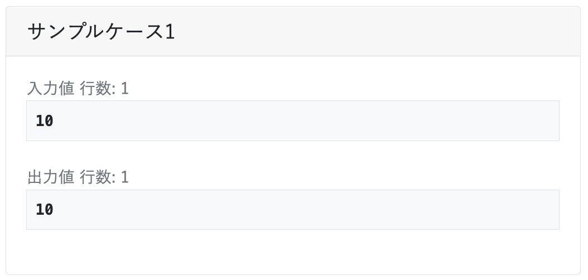

# 1-1. 入力の受け取り
競技プログラミングではまず，与えられた入力を変数やリストに保管する必要があります。  
一口に入力と言ってもいろいろな形式がありますので，この課題で慣れておきましょう。  
なお，本課題はPython3(3.7.4)を用いる前提で書かれています。

## 1-1-1. 入力を受け取る例
実際の競技プログラミングでは次のように入力が与えられ，それに対する出力が正しいかどうかで採点されます。  
  
※ 上の画像は[TechFUL #5「数値を当てろ」](https://techful-programming.com/user/skill/problem/coding/5)からの引用  

これを実際のコードで解答すると，以下のようになります。   
```Python3
n = int(input())
print(n)
```
1行目が実際に入力を受け取る部分`input()`で，2行目で出力`print()`を行います。  
※ この例では，int型に変換したり，変数nに格納せずとも正答可能です  

## 1-1-2. 複数の入力が1行で与えられる例
| 入力1 | 入力2 |
|:--|:--|
| a b | 10 20 30 |

このように，入力の数が定まっている場合は，それに合った数の変数を用意し，`.split()`で分割して格納します。
```Python3
# 入力1の場合
a, b = input().split()
print(a)
print(b)
```

```Python3
# 入力2の場合
x, y, z = input().split()
print(x, y, z)
```


## 1-1-3. 入力の数が最初に与えられる例
| 入力1 | 入力2 |
|:--|:--|
| 3 <br> a <br> b <br> c | 5 <br> 10 <br> 20 <br> 30 <br> 40 <br> 50 |

この場合，入力の数をnに格納し，その後forループなどで`input()`を繰り返すという方法が考えられます。   
ただし，`n`をfor文で使うには整数型（int型）である必要があるので，`int()`を使って変換したものを格納します。  

その後，リストの定義`hoge = []`と追加`.append()`で全ての入力を格納します。　　
```Python3
n = int(input())
hoge = []
for i in range(n):
  hoge.append(input())
print(hoge)
```

## 1-1-4. 入力の数が最初に与えられる例2
2行目以降が改行ではなくスペース区切りなどの場合もあります。
| 入力1 | 入力2 |
|:--|:--|
| 3 <br> a b c | 5 <br> 10 20 30 40 50 |

この場合は，1-1-2で説明した`.split()`に`list()`を用います。  
1-1-3の例とは異なり，リストの初期化は不要です。  
```Python3
n = int(input())
hoge = list(input().split())
print(hoge)
```


## 課題
次の入力を１つ残さず変数またはリストに格納し，その後表示するコードを記述してください。  
複数の入力例がある場合，いずれも同一のコードで対応できるものとします。  


1. はじめにデータ数nが与えられます。整数データとしてリストに格納してください。

| 入力1 | 入力2 |
|:--|:--|
| 3 <br> 10 <br> 20 <br> 30 | 5 <br> 0 <br> 1 <br> 2 <br> 3 <br> 4 |

| 出力1 | 出力2 |
|:--|:--|
| [10, 20, 30] | [0, 1, 2, 3, 4] |


2. はじめにnとmが与えられます。なお，nは行数，mは1行あたりのデータ数とします。

| 入力1 | 入力2 |
|:--|:--|
| 3 <br> 4 <br> 11 12 13 14 <br> 21 22 23 24 <br> 31 32 33 34 <br> | 2 <br> 3 <br> a b c <br> d e f |

| 出力1 | 出力2 |
|:--|:--|
| [['11', '12', '13', '14'], ['21', '22', '23', '24'], ['31', '32', '33', '34']] | [['a', 'b', 'c'], ['d', 'e', 'f']] |


3. 次の入力を **整数型に変換** して受け取って表示しましょう。

| 入力 |
|:--|
| 11 22 33 |

| 出力 |
|:--|
| [10, 20, 30] |


4. 次の入力を **整数型に変換かつ1行** で受け取って表示しましょう。
※ ここでは説明していないものを使います。調べて解答してください。

| 入力 |
|:--|
| 11 22 33 |

| 出力 |
|:--|
| [10, 20, 30] |

